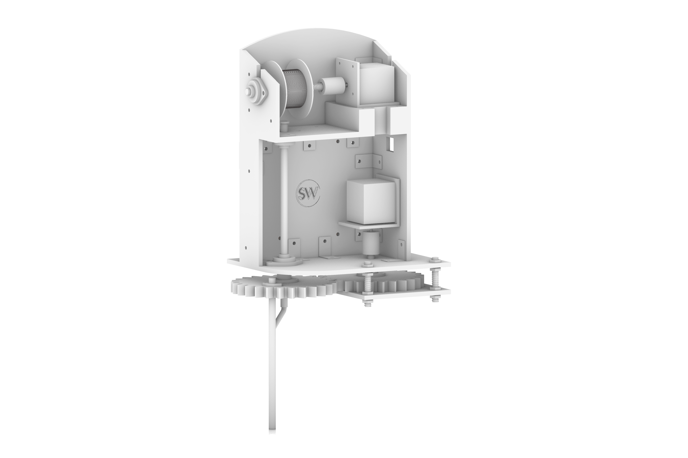
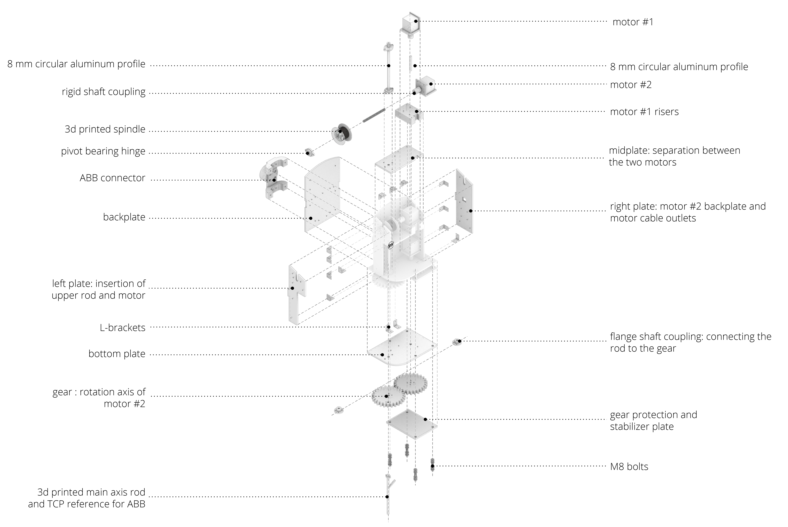
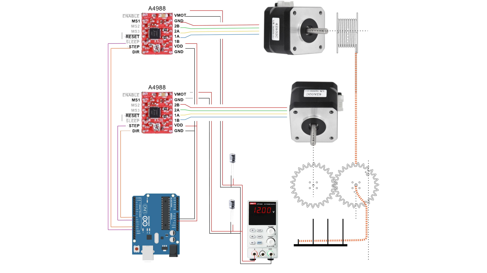

## **SHAPEWEAVER // HARDWARE I**
End effector design for the IRB 140 to weave metal shapes on a base.
### **Shapeweaver Design**

### **Shapeweaver Assembly**

 
### **Shapeweaver Composition**

### **Shape Weaving Goals**
### The vision of this end effector, connected to the IRB 140 would weave metal shapes around rods of a base, starting with an anchor connection point.

### **Electronics**
### Arduino Schematics

**SHAPEWEAVER // HARDWARE I** is a project of **IAAC, Institute for Advanced Architecture of Catalonia**, developed at the Master in Robotics and Advanced Construction in 2020/2021 by:

**Students:** Shahar Abelson and Helena Homsi

**Faculty:** Angel Munoz

**Faculty Assistant:** Matthew Gordon